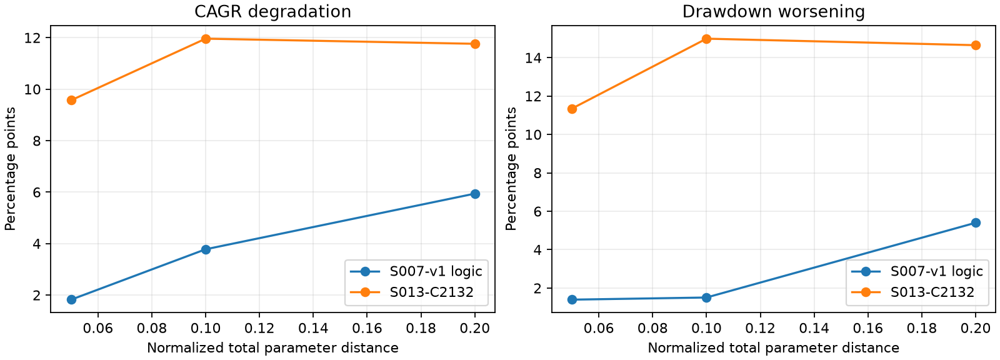

# S007-v1 与 C2132：标准化总扰动距离对齐补测

本轮按用户批准的共同总调整距离完成补测。主表每格来自同一档半径下的32个事前固定联合配置，单位均为百分点。它回答“在已声明参数域下，同样的整套配置误差会造成多大退化”。

主表统一采用每侧0.1%（10bp）的基准费用；原每侧0.2%的费用压力结果作为独立历史证据保留。

三档结果中，S007的年化退化和回撤恶化均小于C2132。这支持：在本轮声明参数域和各自原生开发池下，S007参数抗偏差更好。这是一项有条件的参数稳健性结论；标的、时期和账户合同不同，仍不直接判定两套策略的总体赢家，也不新增淘汰门槛。

| 总调整距离 | S007年化退化 | C2132年化退化 | S007回撤恶化 | C2132回撤恶化 |
| --- | ---: | ---: | ---: | ---: |
| 5% | 1.8208 | 9.5670 | 1.3962 | 11.3476 |
| 10% | 3.7784 | 11.9601 | 1.5081 | 14.9889 |
| 20% | 5.9399 | 11.7609 | 5.4009 | 14.6497 |

年化退化=`max(0, 中心净年化−32点净年化LINEAR Q10)`；回撤恶化=`max(0, 32点回撤幅度LINEAR Q90−中心回撤幅度)`。Q10和Q90是有限点位的分位数，不是置信界限。中心净年化分别为23.7659311777%和16.1572244023%，回撤幅度分别为10.8123474573%和14.1598516294%。原八点诊断仍按旧协议保留，没有用新结果覆盖。

三档使用不同的固定方向，边界约束和整数可行性也影响方向分布，曲线不要求单调。大档的退化略小于中档只代表这组有限点位的结果，不能推断更大的参数误差更安全。

## 怎样对齐

每项改动除以事前声明的参数域宽度，再计算这些相对改动的欧氏总距离。双方联合点严格使用0.05、0.10、0.20三档相同总距离；参数维数为S007八维、C2132十三维。比较的是相同总误差，不是每个参数相同误差，也不是同等市场风险。

S007五个权重坐标沿用原历史分组域。三个冻结门槛的刻度，以冻结中心权重、原2021-01-04至2023-12-31发现期，把原分位数搜索域转换成固定数值域：入场[-0.0147381538,0.1161132342]，退出[-0.1089765874,0.0609990126]，确认[-0.4703754547,0.0557799643]。689个有效基础分数、102个无确认门槛基础入场；三个中心门槛按原已选分位数重构误差均为0。这个转换只用于定刻度，每个扰动点的数值门槛直接调整，不重新估计分位门槛。

C2132含两路窗口、入退场门槛、持有期、熊路ACF门槛、市场状态窗口及门槛、确认门槛及确认窗口。域来自原父参数搜索及路由定向扩边的数值包络。窗口在历史搜索中多为稀疏选项，本轮整日插值属于新增的诊断设计。牛路入场0.05..0.85，熊路0.05..0.985，避免把熊路扩边归于牛路。全部精确域、出处与源哈希见事前协议和域审计。协议固定规则中的归一化固定指S007的252/20规则；C2132确认归一化lookback明确属于本轮13维扰动，不保持固定。

随机方向使用种子13；整数按半偶取整，保留整数改动，再调整连续部分使实际总距离回到同一档。只在账户计算前按域界、执行参数契约、权重和、单权重上限及入场/退出关系筛查几何可行性。任何经济结果都不参与选点。约束及整数处理使样本成为条件化的离散/连续混合方向样本，不能称严格均匀球面。

C2132确认窗口中心120在域上界，只能缩短或不变；S007入场门槛也靠近上界。边界形状仍不同，因此共同距离是一项明确的比较约定，不是消除所有结构差异。小半径下部分整数参数不变，实际改变次数由几何审计逐项列出。

## 逐参数和交易行为补证

逐参数正反方向各三档，共126个声明轴点；18个越界或无变化轴点明确保留为不可评价，其余不混入主表。主联合点192个，加108个可行轴点，共300个不同配置。轴点整数取整后的实际距离逐点列明，不能按名义距离冒充严格对齐。

| 策略 | 检查项 | 已测最敏感方向 | 实际距离 | 年化变化 | 回撤变化 |
| --- | --- | --- | ---: | ---: | ---: |
| S007 | 收益 | opportunity_share_nonrisk 下调（C9528） | 0.2000 | -13.4858 | +2.7350 |
| S007 | 回撤 | exit_threshold 下调（C9535） | 0.2000 | -0.9869 | +5.4054 |
| S013 | 收益 | bear.acf_min 上调（C6135） | 0.1000 | -8.4132 | +3.2674 |
| S013 | 回撤 | bear.acf_min 下调（C6154） | 0.2000 | -6.7871 | +21.7342 |

上表只从已完成的可行单参数方向中列出最大收益损失和最大回撤增加，便于定位脆弱处；不同距离和方向不能用来比较双方总排名。S007收益最敏感方向把约4.755个百分点权重从外围市场机会信息转给ETF自身价格偏离信号，年化从约23.77%降至10.28%，而目标持仓只改变58个交易日。S007回撤最敏感方向是要求分数跌得更低才卖，回撤从约10.81%升至16.22%。少数交易决策变化也可能造成较大损失，收益和回撤的脆弱方向需分别解释。

C2132的小档补证更具体：下跌状态最长持仓从4天减至3天，年化减少4.3921个百分点，实际标准化距离0.03448；把下跌路径的涨跌相关性过滤门槛从0.1放松至0.045，回撤增加10.4601个百分点，实际距离0.05。全部已测轴中，把该门槛提高至0.21损失收益最多，降低至−0.12增加回撤最多。下一轮归因可优先定位弱势路径的过滤和退出决策，核对哪些买卖变化造成损失；本轮没有据此重新优化或断言现有组件无法改善。

行为变化比例按各自完整账户的交易日目标持仓序列与中心相比计算。每档先按比例和候选ID排序，两侧按同一排名配对，仅保留差异不超过1个百分点的配对；不看收益后选配对。下表年化变化为相对中心的有符号变化，负数代表下降。

| 总距离 | S007目标持仓改变比例Q10..Q90 | C2132目标持仓改变比例Q10..Q90 |
| --- | ---: | ---: |
| 5% | 0.66%..1.73% | 4.36%..11.05% |
| 10% | 1.11%..2.96% | 10.50%..17.16% |
| 20% | 3.07%..4.87% | 15.54%..23.48% |

| 总距离 | 行为变化比例接近的配对数 | S007平均年化变化 | C2132平均年化变化 |
| --- | ---: | ---: | ---: |
| 5% | 0/32 | 无可比较配对 | 无可比较配对 |
| 10% | 0/32 | 无可比较配对 | 无可比较配对 |
| 20% | 0/32 | 无可比较配对 | 无可比较配对 |

这项结果只描述已匹配子集。配对数量和未匹配点必须同时看；持仓变化比例接近也不保证日期、行情和交易形态相同，不能替代参数抗偏差主检验。

本轮三档行为配对均为0/32，配对收益均值明确保留为缺失。共同参数距离已经对齐，但没有建立“同样多的目标持仓改变时，哪边收益更稳定”的行为对照。观察上，C2132相同参数总改动会改变更多交易日的持仓目标；这解释了需要进一步归因的决策敏感性，不能把它视为已匹配同等市场或交易风险。

## 复现、边界和证据

每侧中心在当前公共准备流程重新绑定输入并完整复算，与原正式中心的所有非身份账本字段逐值一致。302份中心及扰动完整账户证据经公开校验；独立审计从权益复算净年化、回撤及分位数，并核验现金、数量、费用和行为变化比例。几何审计独立重建全部点位，实际联合半径误差最大4.52e-16。Ruff和聚焦证据检查通过，未做全仓回归。

独立复算与主分析共2067项精确对照，差异数0，最大数值差0；包括中心、三档分位、300个点、126条轴声明以及全部行为排序和未匹配记录。每侧另核对旧正式中心作为控制。原S007控制证据含基准及额外20bp压力场景，审计按本轮事前费用约定逐项验证基准10bp，并保存完整费用场景差异说明。

首轮4个S007子配置误带中心输入绑定，被公共校验拒绝，没有产生经济结果。失败面板独立发布；研究请求显式修正为逐配置重新准备输入，在`panel_rebound.json`保存完整成功后继。点位、参数、策略实现及事前协议没有改变，未对失败点自动换点或填零。

随后Windows多进程句柄异常导致4个S007点没有可用账户证据。此前40个成功账户全部保留，失败面板公开发布，研究员显式决定在相同点位上以单工作进程继续；没有自动重试或平台降级实现。两侧完整结果均沿用事前点位，没有根据收益替换点位。

C2132最初的新窗口准备请求不在旧精确缓存选择器内，计算在准备阶段停止。现明确固定到本批已授权的原生准备引用`bd5c9b30-98fb-455f-958a-04383bd8cacd`，通过公共`fetch`读取子窗，再由公共`prepare`生成子配置绑定。最大预热246日对应的最早日历请求2018-08-28和HFQ输入2018-12-27均在原资产内；最宽HFQ子窗1881行通过原真实质量证据检验。没有获取新数据、补签旧元数据或手工改变绑定；原执行数据、策略实现、费用与评价窗口保持一致。覆盖证明见正式材料目录中的`pinned_source_check.json`。

C2132单队列前20份成功账户先公开保留。为缩短每4点约90秒的等待，研究员显式停止本轮已核实身份的单队列进程，把原固定点位按事前序号模3划分为三个互不重叠的单进程队列。合并时核对全部163个ID无遗漏、无重叠，原20行逐值不变；剩余143点仍按原参数计算，没有根据已见收益改点。中断时尚未公开的下一组点位独立注明，总计算进程数3仍在原上限4内；没有平台改动或自动降级。

原生上下文保持：S007为588080.SH、100000元、2021-01-05..2026-09-02、不复权账户及继承冻结交易逻辑的研究观测适配版；C2132为510500.SH、1000000元、2020-01-02..2026-09-30、原HFQ_RESEARCH合同。不开启新样本、不用封存数据、不调整经济硬门、不改冻结发布或平台。两侧开发池已经参与选择，结果不代表未见样本的表现，不形成总体胜负或新的候选淘汰规则。

旧整手基准确认仍是独立待办。本轮参数年化与回撤退化没有用该基准计算，不受旧零碎份额差异影响。

- [事前完整点位与域](../protocols/plan.json)、[事前材料引用](../protocols/plan_reference.json)。
- [完整结果材料引用](../protocols/results_reference.json)、[域和独立几何审计](../protocols/audit_references.json)。
- [正式材料目录](../protocols/evidence_catalog.json)、[材料完整性校验](../protocols/package_validation_reference.json)。
- 原始账户及数据资产保存在相应`research/S007/assets`、`research/S013/assets`，不随Git自动保存；必要源码、方法与结果已显式发布为不可变材料。

下一步根据三档曲线及行为配对覆盖度判断是否需要针对具体脆弱参数继续补证，再讨论观察资源分配；阶段五、冻结及PTE需要另行授权。
