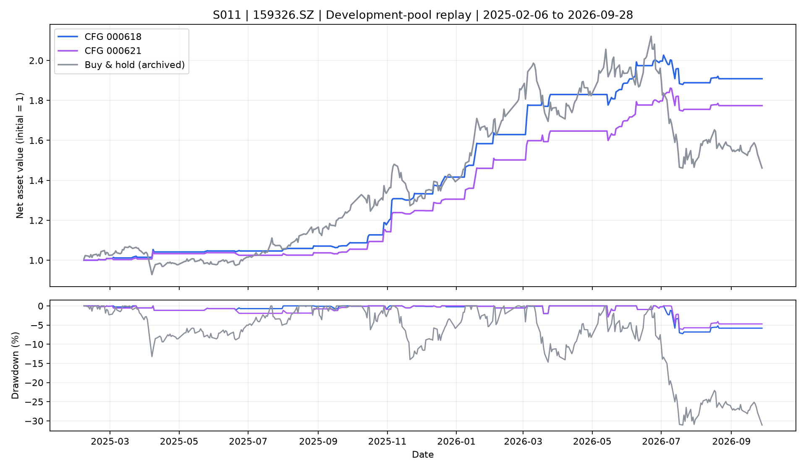

# 618与621开发池完整账户回测

本次通过公共SRT/TXE分别重新计算两个固定配置。窗口2025-02-06至2026-09-28，共403个交易日；初始现金100万元、初始空仓，单边成本10bp，买入LIMIT、卖出MARKET。各自复用同身份受管输入，结果另存。

| 指标 | 000618 | 000621 | 同口径买入持有 |
| --- | ---: | ---: | ---: |
| 累计收益 | 90.86% | 77.39% | 46.14% |
| 年化收益 | 49.81% | 43.11% | 26.78% |
| 最大回撤 | 7.25% | 6.15% | 31.09% |
| 期末权益（元） | 1,908,568.35 | 1,773,913.89 | 1,461,437.84 |
| 闭合交易笔数 | 40 | 40 | — |
| 每60交易日频率 | 5.955 | 5.955 | — |
| 闭合交易胜率 | 72.50% | 70.00% | — |
| 累计费用（元） | 116,695.05 | 109,054.71 | — |

买入持有引用既有同窗口、同资金及同成本账户，本轮只重跑两个指定配置。

两个配置的决策、订单、成交、资金和交易五张账本分别与EX24 T003/T007一致，数值容差见verification.json；账户现金与持仓估值对账通过。期末均为空仓。

- [618逐笔交易](CFG000618/trades.csv) · [618每日账户](CFG000618/account_daily.csv) · [618指标](CFG000618/metrics.json)
- [621逐笔交易](CFG000621/trades.csv) · [621每日账户](CFG000621/account_daily.csv) · [621指标](CFG000621/metrics.json)
- [结构化汇总](summary.json) · [核验](verification.json) · [输入与文件清单](manifest.json)

可重执行入口为research/S011/stage4/iteration_03/src/replay.py；分别传入--config-id、该身份的--data-dir和新的.tmp目录--output。原EX24 T003/T007受管目录是显式运行依赖；input_snapshot只作归档证据，禁止移植成其他身份的缓存。若本机受管目录被清理，需通过公共数据准备入口重新准备并核验身份。

这是已见开发池的同输入复算，验证可复现性；不增加独立样本，也不改变参数扰动与搜索偏差结论。当前仍待用户决定是否晋升。
